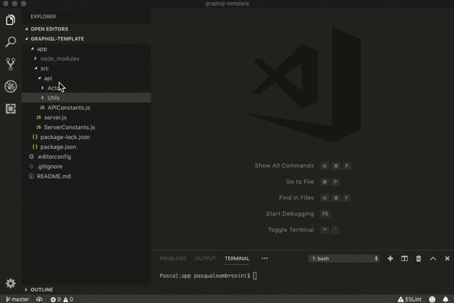
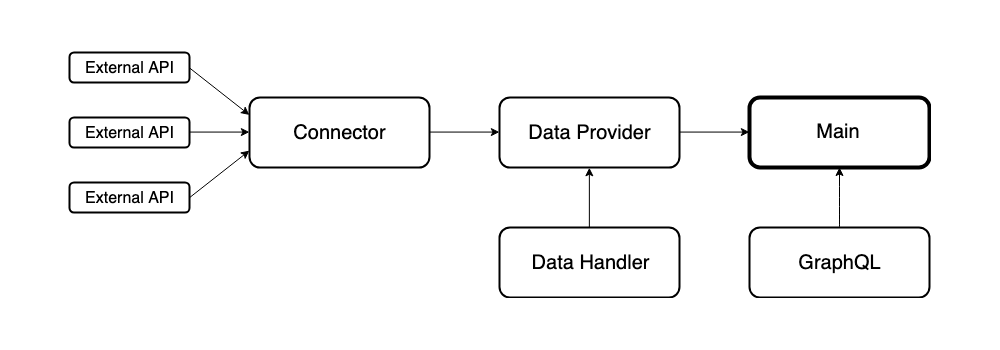

# GraphQL-NodeJS API Module Template

The aim of this template is to give to developers the guidelines for a new module/component API in a project based on our [GraphQL-NodeJS Project Template](https://github.com/vidiemme/GraphQL-Template).

## Install in Visual Studio Code

- Install [VZ Templates](https://marketplace.visualstudio.com/items?itemName=VisualZoran.vz-file-templates) in Visual Studio Code
- Edit VS Code `settings.json` adding:
    ```
    "vzfiletemplates.userTemplatesFolders": ["~/Documents/VSTemplates"]
    ```
-  Copy the `graphql-module` folder to the path defined in `settings.json`
-  Restart VSCode

## New Module

Create a folder in `app/src/api/YOUR_MODULE_NAME`, right click on it, `New File from Template`, select `GraphQL-NodeJS`, name your Module and click on `OK`.

A README isn't really a README without a GIF, so here it is:



## How it works
Each module is composed of multiple components, each component follows the single responsability principle, can be mocked or replaced at runtime.

## Scheme



### Module name: Actor
| FILE NAME | WHAT IT DOES |
| ------ | ------ |
| ActorConnector.js | Retrieves data from an external service, useful for External-API encapsulation |
| ActorDataProvider.js | Consumes data from the Connector and prepares data for GraphQL |
| ActorDataHandler.js | Handles data, save on a DB, create logs and any additional task |
| Actor.js | Consumes data from the DataHandler and exposes all the resolvers for GraphQL |
| Actor.graphql | Defines all the queries and mutations for GraphQL |
| MockActorConnector.js | Replaces the ActorConnector, defines mocked data simulating data response from an external service/API |
| MockActorDataHandler.js | Replaces the ActorDataHandler, executes any additional task on the received data |


## Release History

* 0.1.0
    * CHANGE: Readme.md

* 0.0.1
    * Work in progress

## Meta
Vidiemme - [www.vidiemme.it](https://www.vidiemme.it) - info@vidiemme.it

Distributed under the MIT license. See ``LICENSE`` for more information.

[https://github.com/vidiemme/](https://github.com/vidiemme/)

## Contributing

1. Fork it (<https://github.com/vidiemme/TS-Express-Project-Template/fork>)
2. Create your feature branch (`git checkout -b feature/fooBar`)
3. Commit your changes (`git commit -am 'Add some fooBar'`)
4. Push to the branch (`git push origin feature/fooBar`)
5. Create a new Pull Request
